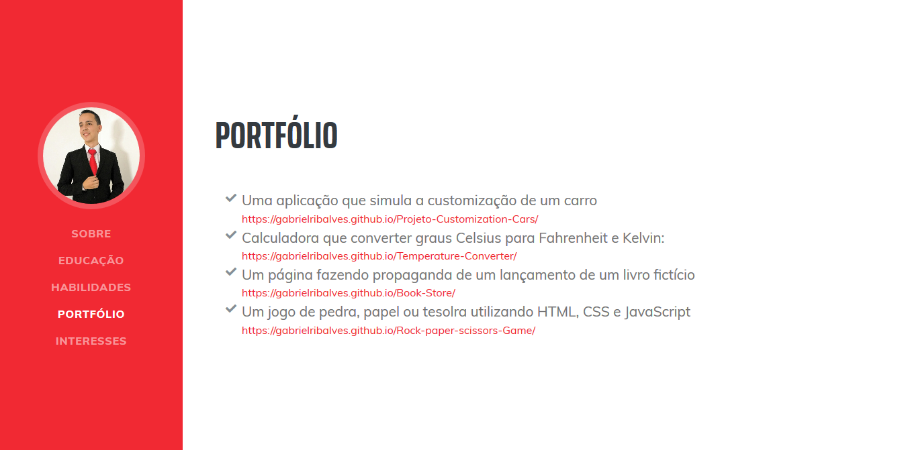

<!DOCTYPE html>
<body>
<h1> Currículo </h1>
<a href="https://gabrielribalves.github.io/GabsCurriculum/" target="_blank">Clique para ver o site</a>

Uma página com a fínalidade de mostrar meu currículo

<h3>Prints do Site</h3>
    

        
        <h4>Sobre</h4>
    

    

        
        <h4>Habilidades</h4>
    

    
   
        
        <h4>Portfólio</h4>
    

<h3>Prints do Site em tela Mobile</h3>
    

        
        <h4>Sobre Mobile</h4>
    

    

        
        <h4>Habilidades Mobile</h4>
    

    
   
        
        <h4>Portfólio Mobile</h4>
    

</body>
</html>
